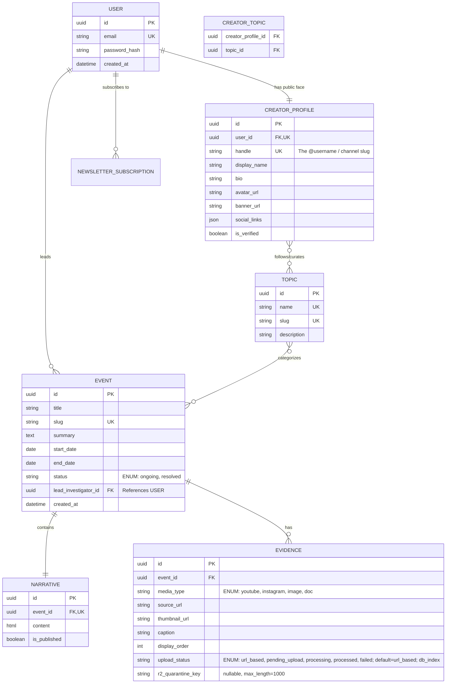
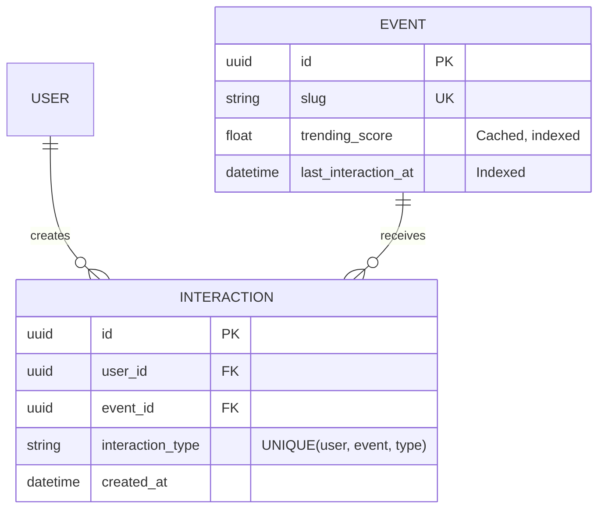

# Codebase Metadata & Immutable Schemas

## ER Diagram

## Stable Architecture Requirements Log
- **The Handle is the Source of Truth for URLs:** The frontend will route all channel pages via the `handle` (e.g., `clarity.com/@investigator`).
- **Search is Filter-Based:** For the MVP, the `/api/v1/search` endpoint will use Django's `__icontains` on the Event Title, Summary, and Narrative content. No Full-Text Search engines yet.
- **Feed Pagination:** All feed and search endpoints must return paginated results using cursor-based pagination.
- **Topic Curation vs. Event Tagging:** Creators select existing global `TOPIC`s to tag Events. `CREATOR_TOPIC` is strictly for defining covered beats on public profiles.
- **Strict Separation:** Narrative (text) and Evidence (media) must be distinct database objects, not inline embeds.
- **Tooling Defaults:** Use pnpm (Frontend), uv (Backend), Biome (Frontend Linter/Formatter), Ruff (Backend Linter/Formatter), and pre-commit for Git hooks.
- **Testing Strategy:** Use pytest with playwright (e2e). Tests are separated into `tests/unit`, `tests/e2e`, and `tests/integration`. Note: Unit and integration tests must be co-located with the features they test (e.g., `apps/backend/apps/*/tests/` or `apps/frontend/features/*/components/__tests__/`). E2E tests are centralized in `e2e/`.
- **The "No Cross-Feature" Rule:** A component in `features/events/` cannot import a component from `features/channels/`. If they need to share UI, it must be extracted into the `shared/components/` directory.
- **The "Thin App" Rule:** Files inside the `app/` directory should be under 50 lines of code. Their only job is to call a server-side data fetcher, pass the data to a `features/` component, and handle loading/error states.
- **The "Backend Boundary" Rule:** Django apps (`apps/events/`, `apps/users/`) cannot import models or services from each other directly. If `events` needs data from `users`, it must do so via the User ID (Foreign Key), or by calling a shared service in the `core/` directory.
- **HeyAPI Pipeline:** The frontend uses `@hey-api/openapi-ts` to automatically generate SDK functions, Zod schemas, and TanStack React Query hooks from the Django Ninja OpenAPI schema. The `generated/` folder must be committed to git.
- **HeyAPI Auth Interceptors:** Native `fetch` is used. A global auth interceptor must inject the JWT token into requests.
- **SSR vs Client Fetching (The "Prop-Drilling" Rule):** Server Components (`app/`) use direct `fetch` calls via generated SDK functions and pass the data down as props. Client Components (`features/`) **NEVER** fetch data for initial page loads; they receive props from the server to guarantee SEO, and only use generated React Query hooks for mutations or infinite scrolling.
- **Event Editor Orchestration:** The "Slug" is the Anchor (Shell must be created before Narrative/Evidence can be saved). Narrative and Evidence maintain independent `isDirty` flags to prevent unnecessary API calls.
- **Optimistic UI for Evidence:** When adding media via URL, the frontend updates immediately while the `POST /evidence` happens in the background.
- **No Inline Media in Text:** Rich-text editors must explicitly exclude media upload/insert buttons. All media must exist as structured `Evidence` database objects.
- **Migration Policy:** Never edit existing migrations. Always test locally. One migration per logical change. Data migrations separate from schema migrations. Backwards-compatible changes only (Add -> Migrate Data -> Remove).
- **Seeding Strategy:** Seed scripts use Django management commands (`seed_global_topics`, `seed_dev_data`). Production only receives global topics via `seed_global_topics` (which must be idempotent). Local dev gets fake users and events via `seed_dev_data`.
- **Ranking System:** All ranking weights (`RANKING_WEIGHT_*`, `RANKING_TIME_DECAY_*`) are env-var-driven. Never hardcode numerical weights in committed code. The formula is committed; the production values stay in `.env`. The trending score is a cached float field on `Event`, updated asynchronously via signal → task. The `Interaction` model has a DB-level UniqueConstraint(user, event, interaction_type). The transparency endpoint returns qualitative labels only — never raw scores or weight constants.
- **Direct-to-Cloud Upload Pattern:** Evidence file uploads must never be routed through Django or Next.js. The browser uploads directly to Cloudflare R2 via a presigned POST URL issued by Django. Django remains the authority for issuing those URLs and finalizing the database record. This bypasses Vercel's 4.5 MB serverless request-body limit and eliminates RAM buffering on the VPS. The flow is: Django issues presigned URL → Browser POSTs directly to R2 quarantine bucket → Browser calls Django confirm-upload → Celery worker validates and moves file to production bucket.
- **pyvips over Pillow for Image Processing:** All server-side image re-encoding must use `pyvips`, not Pillow. pyvips operates on a streaming pipeline and never loads the full decoded pixel buffer into RAM simultaneously. For a 50 MB JPEG, pyvips uses ~10× less RAM than Pillow, preventing OOM kills on the VPS during concurrent uploads. Images must be stripped of all metadata (EXIF, GPS, ICC profile) and re-encoded as WebP at Q=85 (`strip=true`). Output filenames must end with `.webp`.
- **python-magic for File Type Validation:** File type validation must use `python-magic` to inspect the file's magic number (first ~261 bytes), never the filename extension or the client-supplied `Content-Type` header. File extensions are user-controlled and trivially spoofed. The worker must download only the first 261 bytes for the magic-number check (not the full file). If the detected MIME type is not in the allowed set (`image/jpeg`, `image/png`, `image/webp`, `application/pdf`), the quarantine file must be deleted and `upload_status` set to `failed` — no file is written to the production bucket.
- **Quarantine Bucket Pattern:** Two separate R2 buckets are required: (1) `storytrace-quarantine` — strictly private, no public read access at any time; (2) `storytrace-evidence-public` — publicly routable via a custom CDN domain. Uploaded files land in the quarantine bucket first. They only move to the production bucket after the Celery worker has verified the magic number and stripped metadata. This prevents serving malicious or unprocessed files to the public. The `Evidence` model tracks the quarantine key in `r2_quarantine_key` (nullable, cleared on successful processing). The `upload_status` lifecycle is: `url_based` → `pending_upload` → `processing` → `processed` / `failed`. Evidence with `upload_status` not in `{processed, url_based}` must not be visible on public event pages.
---
# ACTIVE WORKING MEMORY BLOCK (DYNAMIC SUFFIX)

## Active Working Objective
Tasks 1.1–1.6, 2.1–2.5 complete (feature/secure-evidence-upload):
- 1.1: Added `boto3>=1.38.0,<1.39`, `celery>=5.4.0,<5.5`, `redis>=5.2.0,<5.3`, `python-magic==0.4.27`, `pyvips>=2.2.0,<2.3` to `apps/backend/pyproject.toml` as pinned runtime dependencies.
- 1.2: Created `apps/backend/config/celery.py` with `Celery("config")` app instance, `os.environ.setdefault("DJANGO_SETTINGS_MODULE", "config.settings.base")`, and `app.config_from_object("django.conf:settings", namespace="CELERY")`. Note: `autodiscover_tasks` deferred to Task 5.3.
- 1.3: Updated `apps/backend/config/__init__.py` to import `app as celery_app` from `.celery` and declare `__all__ = ("celery_app",)`. `from config import celery_app` works without error.
- 1.4: Created `apps/backend/config/settings/` package with `base.py`. All existing settings migrated from flat `config/settings.py`. Added `django-environ>=0.11.2,<0.12` to pyproject.toml. R2 settings (`R2_ENDPOINT_URL`, `R2_ACCESS_KEY_ID`, `R2_SECRET_ACCESS_KEY` — required, no defaults; `R2_QUARANTINE_BUCKET`, `R2_PRODUCTION_BUCKET`, `R2_CDN_DOMAIN` — with defaults) and Celery settings (`CELERY_BROKER_URL`, `CELERY_RESULT_BACKEND`, `CELERY_TASK_ALWAYS_EAGER`) added using `env(...)` calls. `wsgi.py`, `asgi.py`, `manage.py`, `pytest.ini` all updated to reference `config.settings.base`. `.env.test` (gitignored) provides test-env fallback for required R2 keys.
- 1.5: Verified `apps/backend/.env.example` contains all 8 required keys (R2_ENDPOINT_URL, R2_ACCESS_KEY_ID, R2_SECRET_ACCESS_KEY, R2_QUARANTINE_BUCKET, R2_PRODUCTION_BUCKET, R2_CDN_DOMAIN, REDIS_URL, CELERY_TASK_ALWAYS_EAGER) with placeholder values and section headers. Keys were already present from Task 1.4; no file changes required.
- 1.6: Updated `docker-compose.dev.yml`: added `healthcheck` (`pg_isready -U postgres`) to `db` service; added `REDIS_URL=redis://redis:6379/0` to `backend` environment; added `redis:7-alpine` service with healthcheck; added `celery-worker` service with `depends_on` using `service_healthy` for both `redis` and `db`.
- 2.1: Added `UPLOAD_STATUS_CHOICES` list to `Evidence` model with 5 choices: `url_based`, `pending_upload`, `processing`, `processed`, `failed`.
- 2.2: Added `r2_quarantine_key = models.CharField(max_length=1000, blank=True, null=True)` to `Evidence` model.
- 2.3: Added `upload_status = models.CharField(max_length=20, choices=UPLOAD_STATUS_CHOICES, default='url_based', db_index=True)` to `Evidence` model.
- 2.4: Generated and applied `apps/backend/apps/events/migrations/0005_evidence_r2_quarantine_key_evidence_upload_status.py`. All 40/40 backend tests pass. Existing Evidence rows receive `upload_status='url_based'` via the `AddField` default.
- 2.5: Added `upload_status: str = 'url_based'` to `EvidenceSchema` in `apps/backend/apps/events/schemas.py`. `r2_quarantine_key` intentionally NOT exposed (internal state). All 40/40 backend tests pass. Committed as `a57b05f`.
Next: Task 3.1 onwards — presigned URL endpoint / Celery task implementation. Branch: `feature/secure-evidence-upload`. Note: `pyvips` requires native `libvips` OS library — not present in dev env yet.

## ER Diagram Update (Phase 7.1)

