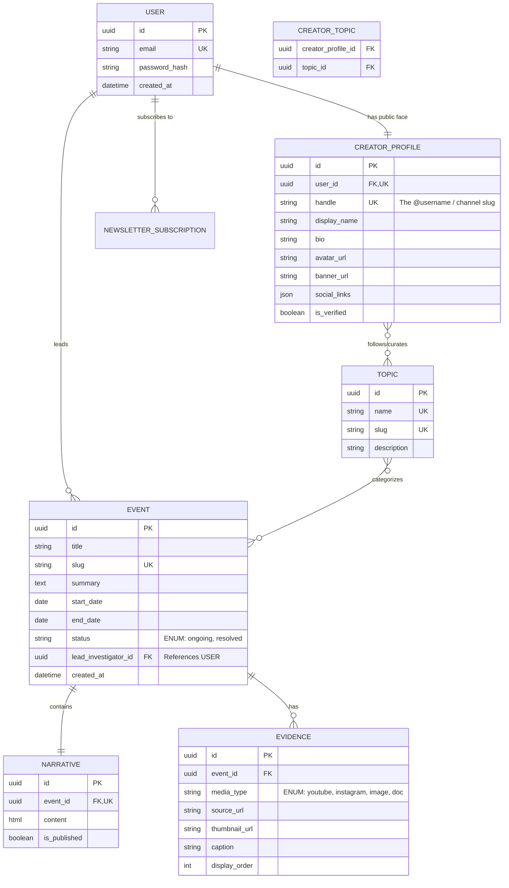

# Codebase Metadata & Immutable Schemas

## ER Diagram

## Stable Architecture Requirements Log
- **The Handle is the Source of Truth for URLs:** The frontend will route all channel pages via the `handle` (e.g., `clarity.com/@investigator`).
- **Search is Filter-Based:** For the MVP, the `/api/v1/search` endpoint will use Django's `__icontains` on the Event Title, Summary, and Narrative content. No Full-Text Search engines yet.
- **Feed Pagination:** All feed and search endpoints must return paginated results using cursor-based pagination.
- **Topic Curation vs. Event Tagging:** Creators select existing global `TOPIC`s to tag Events. `CREATOR_TOPIC` is strictly for defining covered beats on public profiles.
- **Strict Separation:** Narrative (text) and Evidence (media) must be distinct database objects, not inline embeds.
- **Tooling Defaults:** Use pnpm (Frontend), uv (Backend), Biome (Frontend Linter/Formatter), Ruff (Backend Linter/Formatter), and pre-commit for Git hooks.
- **Testing Strategy:** Use pytest with playwright (e2e). Tests are separated into `tests/unit`, `tests/e2e`, and `tests/integration`. Note: Unit and integration tests must be co-located with the features they test (e.g., `apps/backend/apps/*/tests/` or `apps/frontend/features/*/components/__tests__/`). E2E tests are centralized in `e2e/`.
- **The "No Cross-Feature" Rule:** A component in `features/events/` cannot import a component from `features/channels/`. If they need to share UI, it must be extracted into the `shared/components/` directory.
- **The "Thin App" Rule:** Files inside the `app/` directory should be under 50 lines of code. Their only job is to call a server-side data fetcher, pass the data to a `features/` component, and handle loading/error states.
- **The "Backend Boundary" Rule:** Django apps (`apps/events/`, `apps/users/`) cannot import models or services from each other directly. If `events` needs data from `users`, it must do so via the User ID (Foreign Key), or by calling a shared service in the `core/` directory.
- **HeyAPI Pipeline:** The frontend uses `@hey-api/openapi-ts` to automatically generate SDK functions, Zod schemas, and TanStack React Query hooks from the Django Ninja OpenAPI schema. The `generated/` folder must be committed to git.
- **HeyAPI Auth Interceptors:** Native `fetch` is used. A global auth interceptor must inject the JWT token into requests.
- **SSR vs Client Fetching (The "Prop-Drilling" Rule):** Server Components (`app/`) use direct `fetch` calls via generated SDK functions and pass the data down as props. Client Components (`features/`) **NEVER** fetch data for initial page loads; they receive props from the server to guarantee SEO, and only use generated React Query hooks for mutations or infinite scrolling.
- **Event Editor Orchestration:** The "Slug" is the Anchor (Shell must be created before Narrative/Evidence can be saved). Narrative and Evidence maintain independent `isDirty` flags to prevent unnecessary API calls.
- **Optimistic UI for Evidence:** When adding media via URL, the frontend updates immediately while the `POST /evidence` happens in the background.
- **No Inline Media in Text:** Rich-text editors must explicitly exclude media upload/insert buttons. All media must exist as structured `Evidence` database objects.
- **Migration Policy:** Never edit existing migrations. Always test locally. One migration per logical change. Data migrations separate from schema migrations. Backwards-compatible changes only (Add -> Migrate Data -> Remove).
- **Seeding Strategy:** Seed scripts use Django management commands (`seed_global_topics`, `seed_dev_data`). Production only receives global topics via `seed_global_topics` (which must be idempotent). Local dev gets fake users and events via `seed_dev_data`.
---
# ACTIVE WORKING MEMORY BLOCK (DYNAMIC SUFFIX)

## Active Working Objective
Phase 6: Engineering Excellence. TypeScript errors from hey-api v0.99.0 are completely resolved. The application is ready for the next phase.
