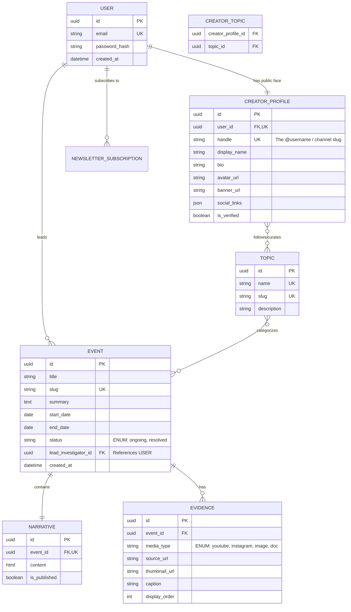

# Codebase Metadata & Immutable Schemas

## ER Diagram

## Stable Architecture Requirements Log
- **The Handle is the Source of Truth for URLs:** The frontend will route all channel pages via the `handle` (e.g., `clarity.com/@investigator`).
- **Search is Filter-Based:** For the MVP, the `/api/v1/search` endpoint will use Django's `__icontains` on the Event Title, Summary, and Narrative content. No Full-Text Search engines yet.
- **Feed Pagination:** All feed and search endpoints must return paginated results using cursor-based pagination.
- **Topic Curation vs. Event Tagging:** Creators select existing global `TOPIC`s to tag Events. `CREATOR_TOPIC` is strictly for defining covered beats on public profiles.
- **Strict Separation:** Narrative (text) and Evidence (media) must be distinct database objects, not inline embeds.
- **Tooling Defaults:** Use pnpm (Frontend), uv (Backend), Biome (Frontend Linter/Formatter), Ruff (Backend Linter/Formatter), and pre-commit for Git hooks.
- **Testing Strategy:** Use pytest with playwright (e2e). Tests are separated into `tests/unit`, `tests/e2e`, and `tests/integration`.
- **The "No Cross-Feature" Rule:** A component in `features/events/` cannot import a component from `features/channels/`. If they need to share UI, it must be extracted into the `shared/components/` directory.
- **The "Thin App" Rule:** Files inside the `app/` directory should be under 50 lines of code. Their only job is to call a server-side data fetcher, pass the data to a `features/` component, and handle loading/error states.
- **The "Backend Boundary" Rule:** Django apps (`apps/events/`, `apps/users/`) cannot import models or services from each other directly. If `events` needs data from `users`, it must do so via the User ID (Foreign Key), or by calling a shared service in the `core/` directory.

---
# ACTIVE WORKING MEMORY BLOCK (DYNAMIC SUFFIX)

## Active Working Objective
Restructuring the architecture into strict Feature Modules (Frontend) and Domain Apps (Backend). Preparing to define HeyAPI and OpenAPI configuration for cross-repo communication.
