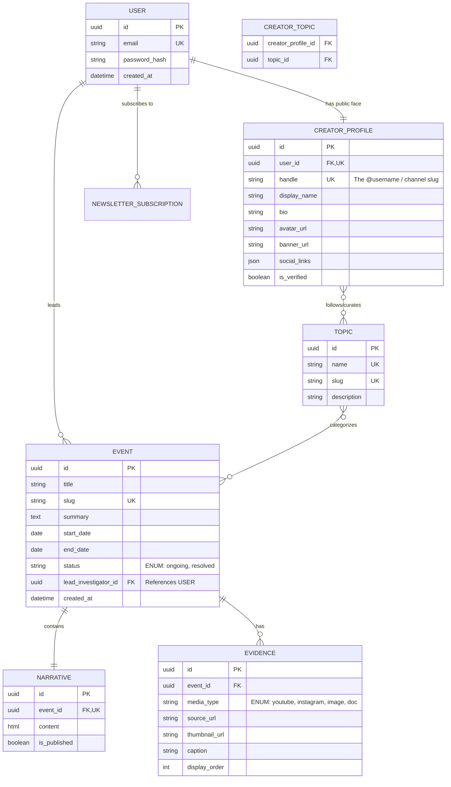

# Clarity

> **Substack for Evidence-Based Media.**

Clarity is a structured, multimedia publishing platform designed for independent journalists, activists, and researchers. It provides creators with a permanent, SEO-optimized home to publish deep-dive investigations where the narrative is permanently backed by an inspectable, structured evidence board.

We are not building a social network. We are not building a wiki. We are building the infrastructure for the modern, evidence-based creator economy.

---

## 1. The Graveyard: Who Tried This and Why They Failed

Before building, we must acknowledge the platforms that attempted similar models and failed. We will not repeat their mistakes.

| Platform | What They Tried | Why They Failed | Our Rule to Avoid This |
| :--- | :--- | :--- | :--- |
| **Storify** | Structured narratives embedding tweets/media. | Rendered as a linear blog post. No separation of story and proof. | **Strict Separation:** Narrative (text) and Evidence (media) must be distinct database objects, not just inline embeds. |
| **NewsTrust** | Crowdsourced rating of news quality/sourcing. | Users hate evaluating sources. High cognitive load. | **Low Friction:** Readers consume the clean summary. Deep evidence inspection is optional, not mandatory. |
| **Kialo / Pol.is** | Structured debate and consensus mapping. | Too academic. Terrible for casual daily consumption. | **Editorial Focus:** This is a publishing platform for creators, not a debate forum for anonymous users. |
| **Web3 Oracles** | Crowdsourced truth via crypto-staking. | Solved a cryptographic problem, ignored UX. | **Consumer UX First:** We do not gamify truth. We provide tools for professional credibility. |

---

## 2. Hard Truths & Core Philosophy

To keep the team aligned, we must accept the following realities about the internet and human behavior:

1. **Subdomains Do Not Equal Reach:** Giving a creator `creator.clarity.com` gives them branding and SEO ownership, not distribution. They still must market themselves on X/Instagram. We provide the *destination*, not the *traffic*.
2. **Never Pay by Views:** Paying creators based on views incentivizes clickbait and destroys platform quality. Creators are monetized via direct reader subscriptions (newsletters), which naturally filters out low-effort spam.
3. **The Public Record Must Be Free:** The Event, the Timeline, and the Evidence are the public record. They are always free and open to drive SEO and viral sharing. Only the creator's premium "Newsletter/Deep Analysis" can be paywalled.
4. **Use Existing Ad Networks, Don't Build Ad-Tech:** We will not build custom tracking or ad-serving infrastructure. We will use existing solutions (like Google AdSense) to handle personalized ads and payouts. *Trade-off: This introduces third-party user tracking, which slightly conflicts with a pure privacy ethos, but is necessary for revenue.*

---

## 3. Product Architecture & Data Model

Clarity abandons the "Post" model. Everything is structured hierarchically to prevent duplication and maintain context.

### The Hierarchy
1. **Topic (The Hub):** Broad, ongoing themes (e.g., "Local Housing Crisis", "2026 AI Regulation"). Acts as a category. No end date. Creators can follow global topics to curate their channel feeds.
2. **Event (The Spoke):** A specific, time-bound incident (e.g., "Eviction of 50 Families on 5th Street"). Has a start date, end date, and status.
3. **Narrative (The Story):** The creator's written text, analysis, or newsletter content.
4. **Evidence (The Proof):** Structured media (YouTube, Instagram, Images, Documents) attached to the Event. Rendered as a distinct "Evidence Board", not just inline text.

### Expanded Core Data Model

### The "First Responder" Creator Model
* **Creation:** A creator clicks "New Event". They must search existing events first to prevent duplication.
* **Ownership:** The creator who creates the Event is the **Lead Investigator/Author**. They own the URL (`/u/creator/event-slug` or via their handle).
* **Collaboration:** Other users can contribute additional Evidence to the public record, but the Lead Investigator controls the primary Narrative and the page's core identity.

---

## 4. Expanded API Endpoints & Discovery

This is the complete, functional REST API required to make the platform usable, including proper session management, channel management, and advanced search/feed routing.

#### Authentication & Session Management
| Method | Endpoint | Description | Access |
| :--- | :--- | :--- | :--- |
| `POST` | `/api/v1/auth/register` | Create user account. | Public |
| `POST` | `/api/v1/auth/login` | Authenticate, return JWT/Session token. | Public |
| `POST` | `/api/v1/auth/logout` | Invalidate session/token. | Authenticated |
| `POST` | `/api/v1/auth/password/reset` | Request password reset email. | Public |

#### Creator Channel Management
| Method | Endpoint | Description | Access |
| :--- | :--- | :--- | :--- |
| `GET` | `/api/v1/channels/{handle}` | Get public channel profile (bio, banner, stats). | Public |
| `PUT` | `/api/v1/channels/me` | Update own channel profile (handle, bio, banner). | Authenticated |
| `POST` | `/api/v1/channels/me/topics` | Add a global topic to the channel's curation list. | Authenticated |
| `DELETE`| `/api/v1/channels/me/topics/{id}`| Remove a topic from the channel's curation list. | Authenticated |

#### Global Topics
| Method | Endpoint | Description | Access |
| :--- | :--- | :--- | :--- |
| `GET` | `/api/v1/topics` | List all global topics. | Public |
| `GET` | `/api/v1/topics/{slug}` | Get topic details and metadata. | Public |

#### Events & Content Creation
| Method | Endpoint | Description | Access |
| :--- | :--- | :--- | :--- |
| `POST` | `/api/v1/events` | Create Event shell. | Authenticated |
| `PUT` | `/api/v1/events/{slug}` | Update Event metadata. | Lead Investigator |
| `POST` | `/api/v1/events/{slug}/narrative` | Create/update the text body. | Lead Investigator |
| `POST` | `/api/v1/events/{slug}/evidence` | Attach media to the event. | Lead Investigator |
| `DELETE`| `/api/v1/events/{slug}/evidence/{id}`| Remove specific evidence. | Lead Investigator |

#### Discovery, Search & Feeds
| Method | Endpoint | Description | Access |
| :--- | :--- | :--- | :--- |
| `GET` | `/api/v1/feed/home` | Global chronological feed of all published events. | Public |
| `GET` | `/api/v1/feed/channel/{handle}` | Feed of events published by a specific creator. | Public |
| `GET` | `/api/v1/feed/topic/{slug}` | Feed of events categorized under a specific topic. | Public |
| `GET` | `/api/v1/search` | **Advanced Search.** Accepts query params: `?q=text`, `?topic=slug`, `?creator=handle`, `?date_from=`, `?status=`. | Public |

---

## 5. Architectural Rules for the Expanded Scope

1. **The Handle is the Source of Truth for URLs:** The frontend will route all channel pages via the `handle` (e.g., `clarity.com/@investigator`). If a user changes their handle, the backend must handle the redirect or enforce strict uniqueness.
2. **Search is Filter-Based, Not Full-Text Engine (For MVP):** For the MVP, the `/api/v1/search` endpoint will use Django's `__icontains` (case-insensitive contains) on the Event Title, Summary, and Narrative content. We will not implement Elasticsearch or Postgres Full-Text Search until we have the traffic to justify the infrastructure cost.
3. **Feed Pagination:** All feed and search endpoints must return paginated results (e.g., 20 items per page) using cursor-based pagination to ensure infinite scrolling works smoothly on the Next.js frontend without performance degradation.
4. **Topic Curation vs. Event Tagging:** When a creator creates an Event, they must select one or more existing global `TOPIC`s to tag it with. The `CREATOR_TOPIC` table is strictly for defining what topics show up on their public Channel profile as "Covered Beats".

---

## 6. Technical Stack

The stack is chosen for type safety, SEO dominance, and rapid development.

* **Frontend:** **Next.js (React)**. Chosen over Astro because we are generating complex React hooks via HeyAPI. Next.js provides native SSR/SSG for perfect SEO and OpenGraph link previews, which are critical for creator distribution.
* **Backend:** **Django Ninja (Python)**. Chosen over FastAPI to leverage Django's mature ecosystem, built-in admin panel, and robust ORM, while maintaining FastAPI-like speed and auto-generated OpenAPI schemas.
* **API Glue:** **HeyAPI + OpenAPI**. Automatically generates Zod schemas and TypeScript types from the Django Ninja backend, ensuring 100% type safety between backend and frontend.
* **Styling:** **Tailwind CSS & Shadcn UI**. We will use Tailwind as a utility engine alongside Shadcn for accessible, customizable components. We will define semantic design tokens to maintain a quiet, editorial, precise aesthetic.

---

## 7. Monetization Strategy

We are building a media platform. The monetization is phased to prioritize growth first.

### Phase 1: MVP (Growth)
* **Cost:** 100% Free for creators and readers.
* **Goal:** Acquire high-quality creators, build the library of structured events, and prove the UX. Zero payment infrastructure.

### Phase 2: V1 (Creator Economy & Ads)
* **Creator Newsletters:** Creators can launch paid personal newsletters. The platform takes a **10% commission** on all subscription revenue (The Substack Model).
* **Third-Party Programmatic Ads (Google AdSense):** Integrate an existing ad network for personalized, pay-per-click/display ads. We do not build custom ad-tech. We let Google handle the targeting, tracking, and payouts via standard scripts. *(Note: Requires sufficient traffic for AdSense approval).*

### Phase 3: V3 (Institutional Data)
* **Enterprise AI API:** Once Clarity is the default host for structured, real-time evidence, we will license our structured data API to AI companies and institutional researchers for a premium fee.

---

## 8. The MVP Scope (What We Are Building Now)

To ship fast, we are ruthlessly cutting features. If it is not in this list, we are not building it for V1.

### In Scope (MVP)
1. **User Auth & Profiles:** Basic sign-up, login, and creator profile setup (Bio, Avatar, Social Links) with Handles (`@username`).
2. **Event Creation Flow:** 
   * Search existing events.
   * Create new Event (Title, Date, Topic/Tag, Summary).
   * Creator is automatically assigned as Lead Investigator.
3. **The Editor (Strict Separation):**
   * **Narrative Box:** Clean rich-text editor for the story.
   * **Evidence Board:** Dedicated UI to attach YouTube URLs, Instagram URLs, and Image Thumbnails. (These render as a structured grid, not inline).
4. **Public Event Pages (SEO Optimized):**
   * Beautiful rendering of Narrative and Evidence.
   * Perfect OpenGraph/Twitter Card meta tags for rich link previews.
   * "Subscribe to Creator Newsletter" button (UI only, no backend processing yet).
5. **The Feed & Discovery:**
   * Global chronological feed of latest Events.
   * Feed of events published by a specific creator.
   * Feed of events categorized under a specific topic.
   * Advanced search (filter-based).

### Out of Scope (Do Not Build Yet)
* Payment processing / Stripe integration.
* Custom subdomain routing (`creator.clarity.com`).
* Community wikis / collaborative editing of the Narrative.
* AI chat, AI summaries, or AI fact-checking.
* Complex reputation systems, upvotes, or engagement confidence scoring.
* Custom ad-tracking infrastructure or proprietary ad servers.
* Elasticsearch or Postgres Full-Text Search.

---

## 9. Next Steps

This document is the law. If a feature request does not align with this README, it is rejected.

**Immediate Action Items:**
1. Initialize the Next.js frontend and Django Ninja backend repositories.
2. Configure HeyAPI to bridge the OpenAPI schema.
3. Define the Django ORM models for `Topic`, `Event`, `Narrative`, `Evidence`, `Creator_Profile`, and `Creator_Topic`.
4. Build the Event Creation API and the corresponding Next.js frontend form.